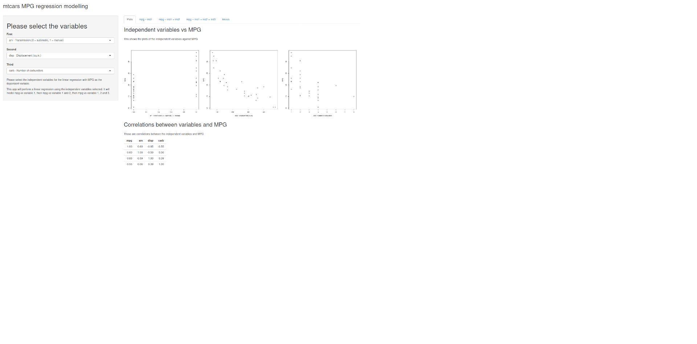
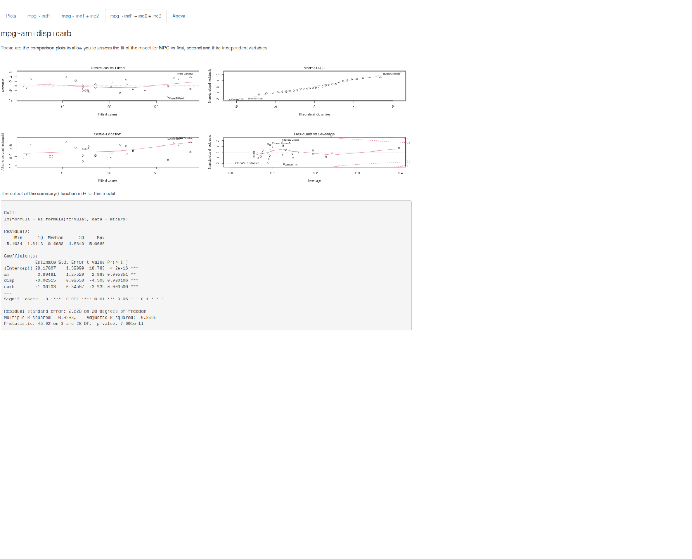
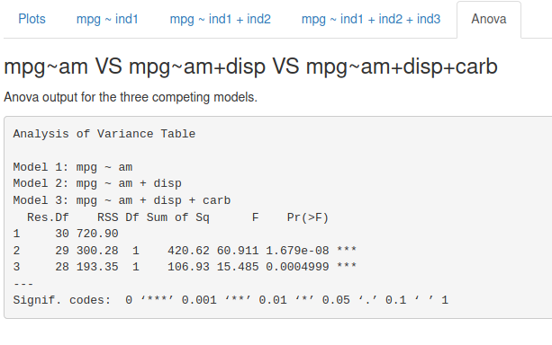

```{r, echo=FALSE, message=FALSE}
today <- strftime(Sys.Date(), "%d %B %Y")
```

```{r, echo=FALSE, message=FALSE}
suppressPackageStartupMessages(suppressWarnings({
library(plotly)
library(slidify)
library(evaluate)
data(mtcars)
}))
```

## Problem

Imagine that you are trying to see which variables in the mtcars data set have an impact on the miles per gallon.

```{r, echo=FALSE, message=FALSE}
head(mtcars)
```

How do you find the best combination of independent variables to do your linear regression? You use the mtcars Shiny App.

--- .class #id

The [mtcars Shiny App](https://matthewfarwell.shinyapps.io/DevelopingDataProductsProject) allows you to try different combinations of the indepdendent variables and see how well they fit the MPG.




--- .class #id

You can model with up to three variables. The mtcars shiny app will, with mp as the dependent variable, perform a linear regression with the independent variables, with: first, first and second, and first, second and third. Each of these is displayed in a tab.



--- .class #id


In the final Anova tab, you have the Anova comparison of the three models.



Go play with [mtcars Shiny App](https://matthewfarwell.shinyapps.io/DevelopingDataProductsProject) now!

