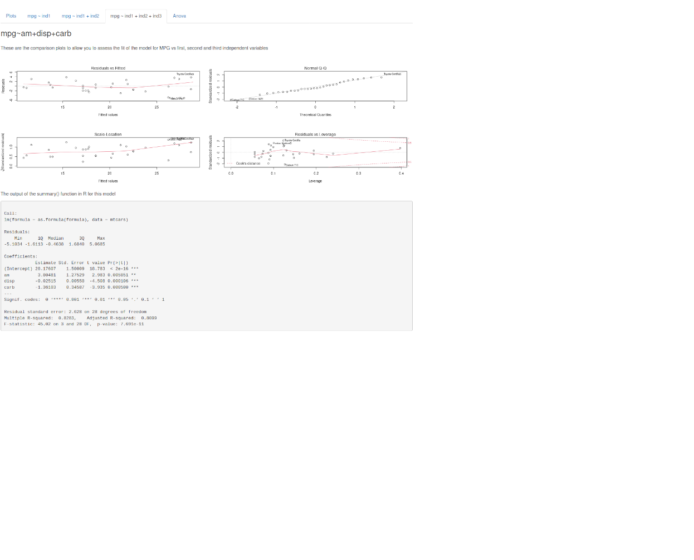

## Problem

Imagine that you are trying to see which variables in the mtcars data set have an impact on the miles per gallon.


```
##                    mpg cyl disp  hp drat    wt  qsec vs am gear carb
## Mazda RX4         21.0   6  160 110 3.90 2.620 16.46  0  1    4    4
## Mazda RX4 Wag     21.0   6  160 110 3.90 2.875 17.02  0  1    4    4
## Datsun 710        22.8   4  108  93 3.85 2.320 18.61  1  1    4    1
## Hornet 4 Drive    21.4   6  258 110 3.08 3.215 19.44  1  0    3    1
## Hornet Sportabout 18.7   8  360 175 3.15 3.440 17.02  0  0    3    2
## Valiant           18.1   6  225 105 2.76 3.460 20.22  1  0    3    1
```

How do you find the best combination of independent variables to do your linear regression? You use the mtcars Shiny App.

--- .class #id 

The [mtcars Shiny App](https://matthewfarwell.shinyapps.io/DevelopingDataProductsProject) allows you to try different combinations of the indepdendent variables and see how well they fit the MPG.


--- .class #id 

You can model with up to three variables. The mtcars shiny app will, with mp as the dependent variable, perform a linear regression with the independent variables, with: first, first and second, and first, second and third. Each of these is displayed in a tab.



--- .class #id 


In the final Anova tab, you have the Anova comparison of the three models.


Go play with [mtcars Shiny App](https://matthewfarwell.shinyapps.io/DevelopingDataProductsProject) now!

